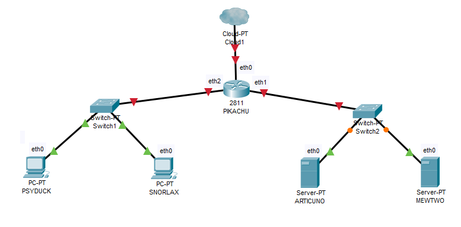

# PENTING UNTUK DIBACA
1. Pastikan UML ARTICUNO dan MEWTWO Memory yang sebelumnya 96 diganti menjadi 256 pada file topologi.sh.
2. Jalankan **iptables** agar client PSYDUCK dan SNORLAX bisa terhubung ke internet
3. Sebelum mengakses internet pastikan sudah mengeksport proxy terlebih dahulu.
4. Jangan melakukan apapun sebelum asisten memberikan perintah.
5. Ikuti apa yang asisten arahkan.
6. Ketika poin 4 dan 5 tidak ditaati, risiko **tanggung sendiri!!!**

# 1. DNS (Domain Name System)
## 1.1 Teori
### 1.1.1 Pengertian
Domain Name System atau DNS adalah sebuah sistem yang menyimpan informasi tentang nama host ataupun nama domain di dalam jaringan komputer, misalkan: Internet. DNS Server berfungsi menerjemahkan nama domain menjadi alamat IP.
### 1.1.2 Cara Kerja

Client akan meminta alamat IP dari suatu domain ke DNS server. Jika pada DNS server data alamat IP dari DNS server tersebut ada maka akan di kembalikan alamat IP nya kembali menuju client. Jika DNS server tersebut tidak memiliki alamat IP dari domain tersebut maka dia akan bertanya kepada DNS server lain sampai alamat domain ditemukan.
### 1.1.3 Aplikasi DNS Server
Berkeley Internet Name Domain atau BIND adalah server DNS yang paling umum digunakan di Internet, khusunya pada sistem operasi bertipe Unix yang secara *de facto* merupakan standar. Untuk praktikum jarkom kita akan menggunakan aplikasi BIND sebagai DNS server.
### 1.1.4 List DNS Record

## 1.2 Praktik
Topologi

[Referensi](https://github.com/afrchmdi/Jarkom-Modul-Pengenalan-UML)
### 1.2.1 Instalasi bind

 - Buka *ARTICUNO* dan update package lists dengan menjalankan command: 
 `apt-get update`

 - Setelah melakukan update silahkan install aplikasi bind9 pada *ARTICUNO* dengan perintah:
 `apt-get install bind9 -y`

### 1.2.2 Pembuatan Domain
Pada sesilab

### 1.2.3 Setting nameserver pada client

### 1.2.4 Reverse DNS (Record PTR)

### 1.2.5 Record CNAME
<!--stackedit_data:
eyJoaXN0b3J5IjpbLTQ4MTc5MjcxOSwxNjU2ODg0Njg5LDExMz
M1NDA5MzAsMzUxNTIyMjQ0LC0xMDQ2ODM2NTQ2LDQyMDI3NDg4
NywtNjY5MTc3Mzg3LDE1OTE5MTE2NjVdfQ==
-->