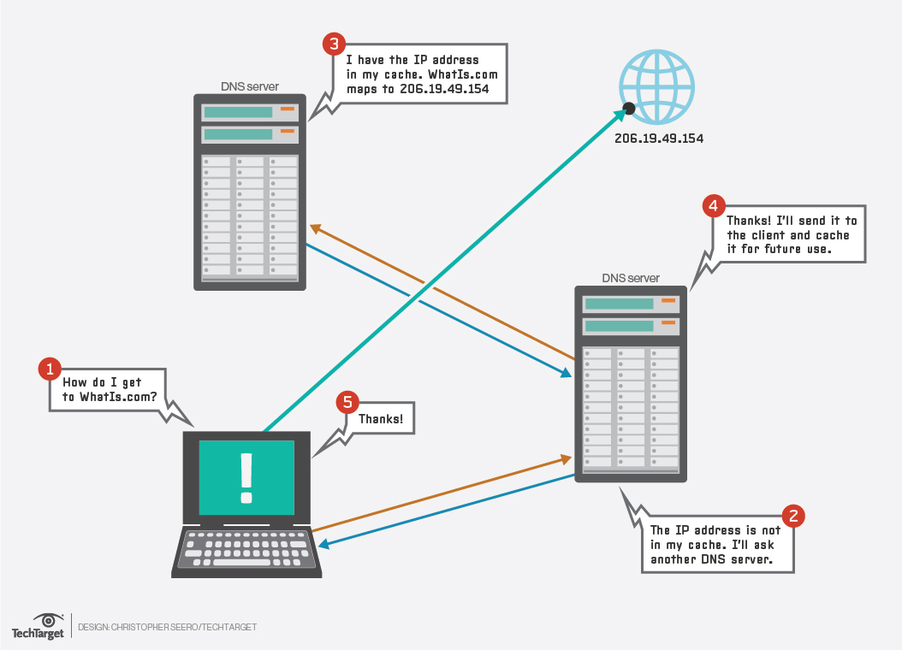

# PENTING UNTUK DIBACA
1. Pastikan UML ARTICUNO dan MEWTWO Memory yang sebelumnya 96 diganti menjadi 256 pada file topologi.sh.
2. Jalankan **iptables** agar client PSYDUCK dan SNORLAX bisa terhubung ke internet
3. Sebelum mengakses internet pastikan sudah mengeksport proxy terlebih dahulu.
4. Jangan melakukan apapun sebelum asisten memberikan perintah.
5. Ikuti apa yang asisten arahkan.
6. Ketika poin 4 dan 5 tidak ditaati, risiko **tanggung sendiri!!!**

# 1. DNS (Domain Name System)
## 1.1 Teori
### 1.1.1 Pengertian
Domain Name System atau DNS adalah sebuah sistem yang menyimpan informasi tentang nama host ataupun nama domain di dalam jaringan komputer, misalkan: Internet. DNS Server berfungsi menerjemahkan nama domain menjadi alamat IP.
### 1.1.2 Cara Kerja

Client akan meminta alamat IP dari suatu domain ke DNS server. Jika pada DNS server data alamat IP dari DNS server tersebut ada maka akan di kembalikan alamat IP nya kembali menuju client. Jika DNS server tersebut tidak memiliki alamat IP dari domain tersebut maka dia akan bertanya kepada DNS server lain sampai alamat domain ditemukan.
### 1.1.3 Aplikasi DNS Server
Berkeley Internet Name Domain atau BIND adalah server DNS yang paling umum digunakan di Internet, khusunya pada sistem operasi bertipe Unix yang secara *de facto* merupakan standar. Untuk praktikum jarkom kita akan menggunakan aplikasi BIND sebagai DNS server.
### 1.1.4 List DNS Record
|Tipe|Deskripsi  |
|--|--|
| A | Memetakan nama domain ke alamat IP (IPv4) dari komputer hosting domain |
| AAAA | AAAA record  |
|  | mirip record A, tapi mengarahkan domain ke alamat IPV6 |
| CNAME | Alias dari satu nama ke nama lain: pencarian DNS akan dilanjutkan dengan mencoba lagi pencarian dengan nama baru |
| NS | Delegasikan zona DNS untuk meggunakan authoritative name server yang diberikan |
| PTR | Digunakan untuk Reverse DNS (Domain Name System) lookup |
| SOA | Mengacu server DNS yang menyediakan otorisasi informasi tentang sebuah domain internet |
| TXT | Mengijinkan administrator untuk memasukkan data acak ke dalam catatan DNS, catatan ini juga digunakan di spesifikasi Sender Policy Framework |
### 1.1.5 SOA (Start of Authority)
Adalah informasi yang dimiliki oleh suatu DNS zone.
| Nama | Deskripsi |
|--|--|
| Serial | Jumlah revisi dari file zona ini. Kenaikan nomor ini setiap kali file zone diubah sehingga perubahannya akan didistribusikan ke server DNS sekunder manapun |
| Refresh | Jumlah waktu dalam detik bahwa nameserver sekunder harus menunggu untuk memeriksa salinan baru dari zona DNS dari nameserver utama domain. Jika file zona telah berubah maka server DNS sekunder akan memperbarui salinan zona tersebut agar sesuai dengan zona server DNS utama |
| Retry | Jumlah waktu dalam detik bahwa nameserver utama domain (atau server) harus menunggu jika upaya refresh oleh nameserver sekunder gagal sebelum mencoba refresh zona domain dengan nameserver sekunder itu lagi |
|  |   |
## 1.2 Praktik
Topologi


[Referensi](https://github.com/afrchmdi/Jarkom-Modul-Pengenalan-UML)
### 1.2.1 Instalasi bind

 - Buka *ARTICUNO* dan update package lists dengan menjalankan command: 
 `apt-get update`


 - Setelah melakukan update silahkan install aplikasi bind9 pada *ARTICUNO* dengan perintah:
 `apt-get install bind9 -y`
 


 - Buat folder **jarkom** di dalam **/etc/bind**
`mkdir /etc/bind/jarkom`


 - Copykan file **db.local** pada path **/etc/bind** ke dalam folder **jarkomtc.com**** yang baru saja dibuat dan diubah namanya menjadi **jarkom**

`cp /etc/bind/db.local /etc/bind/jarkom/jarkomtc.`com`


 - Kemudian buka **jakromtc.com** dan edit seperti gambar berikut dengan IP *ARTICUNO* masing-masing kelompok:

`nano /etc/bind/jarkom/jarkomtc.com`


 - Restart bind9 dengan perintah
```
service bind9 restart
ATAU
named -g //Bisa digunakan untuk restart sekaligus debugging
```
### 1.2.3 Setting nameserver pada client
Domain yang kita buat tidak akan langsung dikenali oleh client oleh sebab itu kita harus merubah settingan nameserver yang ada pada client kita.
 - Pada client *PSYDUCK* dan *SNORLAX* arahkan nameserver menuju IP *ARTICUNO* dengan mengedit file *resolv.conf* dengan mengetikan perintah
`nano /etc/resolv.conf`


### 1.2.4 Reverse DNS (Record PTR)

### 1.2.5 Record CNAME
<!--stackedit_data:
eyJoaXN0b3J5IjpbMTI2Mjg3OTY5OSwyMTM0MTM5NDEzLDQ3Mj
kzNDQwMywxNjQwMzcwOTI5LC0yMDQxODIwNjU2LC02MjU4Mjg1
MzYsMTY1Njg4NDY4OSwxMTMzNTQwOTMwLDM1MTUyMjI0NCwtMT
A0NjgzNjU0Niw0MjAyNzQ4ODcsLTY2OTE3NzM4NywxNTkxOTEx
NjY1XX0=
-->