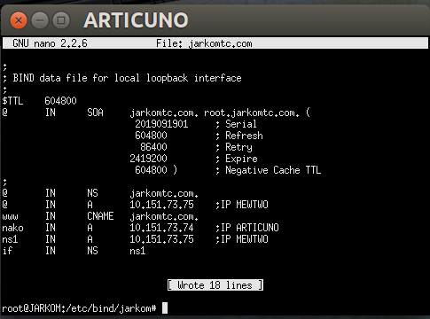
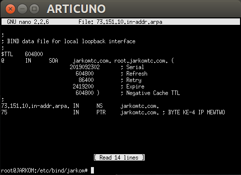
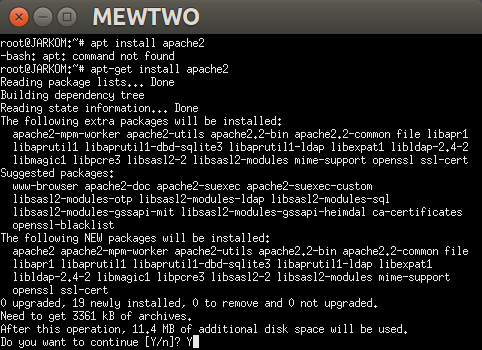
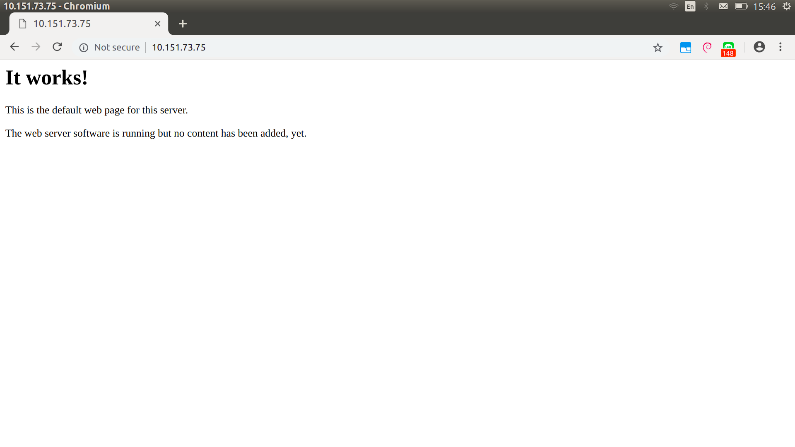
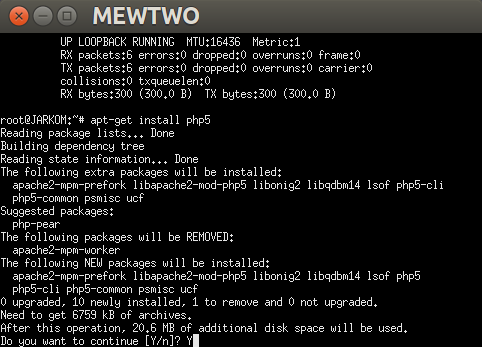
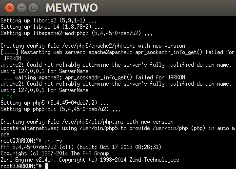
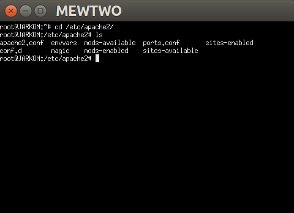
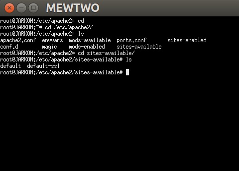
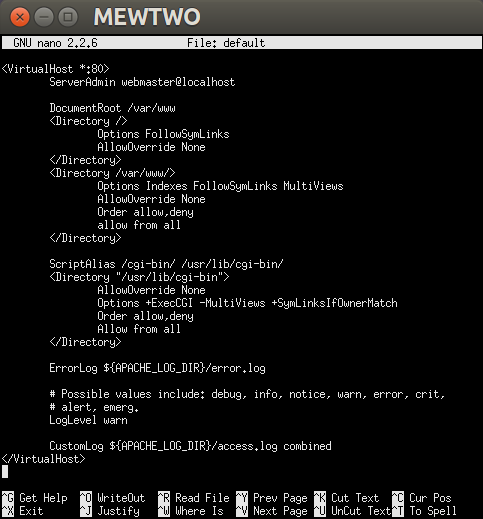
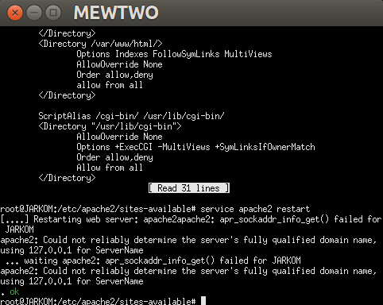

# Web Server
## A. Persyaratan Tambahan untuk Mengikuti Sesi Lab
Record A dan PTR pada jarkomtc.com mengarah ke IP MEWTWO





## B. Penting Untuk Dibaca
1. Pastikan semua UML bisa connect ke internet baik dapat melakukan koneksi ke luar maupun dapat ping dari luar (Khusus DMZ)
2. Pastikan Mewtwo dan Articuno sudah memiliki memory 256M
3. Ketika mengalami kendala/error __cek syntax dan samakan seperti modul__ terlebih dahulu __sebelum__ angkat tangan dan berkata __"Mas/Mbak ini kok gak bisa ya?"__

## C. Dasar Teori
### 1. Web Server
Terdapat dua pengertian dari web server. Secara _hardware_, web server berarti sebuah storage yang digunakan untuk menyimpan semua data dari aplikasi web (file HTML, CSS, JavaScript, dll.). Sedangkan secara _software_,  web server adalah sebuah perangkat yang bertugas untuk menyediakan layanan akses menggunakan protokol HTTP atau HTTPS melalui aplikasi web.

### 2. Load Balancing
#### Kenapa dibutuhkan load balancing?

### 3. Apache Web Server

## D. Instalasi Apache
#### 1. Buka UML _MEWTWO_
Lalu jalankan perintah
```
apt-get install apache2
```
jika muncul tulisan _"Do you want to continue? [Y/n]"_  input `Y` lalu tekan ___enter___. 



#### 2. Buka browser laptop/komputer masing-masing
Buka web __IP Mewtwo Masing-Masing Kelompok__ sampai muncul halaman Apache seperti di bawah ini.



## E. Instalasi PHP
#### 1. Buka UML Mewtwo
Lalu jalankan perintah
```
apt-get install php5
```
jika muncul tulisan _"Do you want to continue? [Y/n]"_  input `Y` lalu tekan ___enter___. 



#### 2. Test apakah php sudah ter-install
Jalankan perintah di bawah ini untuk memeriksa versi dari __php__ kalian.
```
php -v
```
Bila _output_-nya mirip dengan yang di bawah ini, maka __php__ kalian telah ter-_install_.



## F. Mengenal Apache
Web server Apache memiliki _directory_  berisi berbagai konfigurasi yang terletak di `/etc/apache2/`



Berikut beberapa hal yang penting untuk diketahui:
+ File Konfigurasi di 	`/etc/apache2`

|__Nama File__ | __Kegunaan__ |
| --- | --- |
| __apache2.conf__ | file |

+ _Command_ yang sering digunakan

|__Command__ | __Kegunaan__ |
| --- | --- |
| __a2ensite__ | file |
| __a2dissite__ | file |
| __a2enmod__ | file |
| __a2dismod__ | file |

## G. Konfigurasi Apache Sederhana
### A. Penggunaan Sederhana
#### A.1. Pindah ke _directory_ `/etc/apache2/sites-available`
Gunakan perintah `cd /etc/apache2/sites-available`



Dapat dilihat di sana terdapat dua buah file:
+ file __default__, ....
+ file __default-ssl__, ....
#### A.2. Buka file ___default___
Gunakan perintah `nano /etc/apache2/sites-available/default`



#### A.3.  Pada file _default_ terdapat konfigurasi standar apache
Beberapa diantaranya adalah:
##### __Port__ yang digunakan
```
<VirtualHost *:80>
```
Konfigurasi di atas menunjukkan bahwa port yang digunakan adalah port 80

##### ___Directory___ tempat file website kita berada
```
DocumentRoot /var/www
```
+ Untuk sesi lab JarKom ini silahkan mengubah _DocumentRoot_-nya menjadi `/var/www/html`
+ Begitu juga dengan _line_ ke-9, diubah dari `<Directory /var/www/>` menjadi `<Directory /var/www/html>` 

#### A.4. Pindah ke _directory_ yang ditunjuk oleh _DocumentRoot_ pada file _default_
Gunakan perintah `cd /var/www/`
{{ masukin gambar }}
+ Karena tadi kita mengubah _DocumentRoot_ di file _default_ maka sekarang buatlah _directory_ bernama "html" dengan perintah `mkdir /var/www/html`

#### 5. Pindah ke _directory_ `/var/www/html` dan buat file _index.php_
Gunakan perintah `nano /var/www/index.php` dan isi file  tersebut dengan
```
<?php
	phpinfo();
?>
```
#### A.6. Buka browser laptop/komputer masing-masing
Akses alamat __http://[IP Mewtwo]/index.php__




<!--stackedit_data:
eyJoaXN0b3J5IjpbLTIzNzk2NTk1NywtMTExMjcyOTk0NywtMT
A4MDk2NDE3NCwxNTgzMDc4NTQ5LDEzODczNzcwNTQsMjA0Mjk5
MTc3MSwtMTYxNzE0NjMzLC04ODI0MTYyMzAsLTU2MDU0MjExNC
wtNjUwNDkxNjExLC0yMDU4NzE0ODcsMTA1MzQ2MDIxMyw3MTY2
Njk0NTgsLTE2NjA3NzU4NjAsLTExNDQwNjU5NzAsLTUzMTMyNT
QwNSwtNjc3OTM5MDMxLDEzMTk0MDkzNSwtNzkwNTYwMjk2XX0=

-->