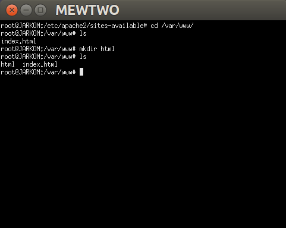
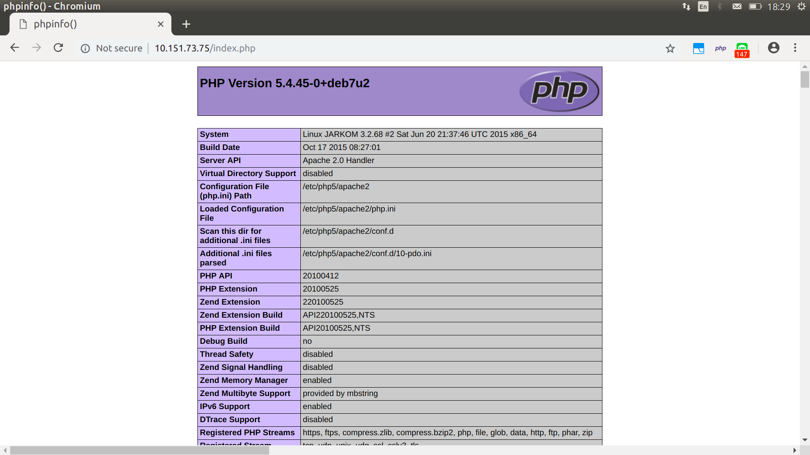

# Web Server
## A. Persyaratan Tambahan untuk Mengikuti Sesi Lab
Record A dan PTR pada jarkomtc.com mengarah ke IP MEWTWO


## B. Penting Untuk Dibaca
1. Pastikan semua UML bisa connect ke internet baik dapat melakukan koneksi ke luar maupun dapat ping dari luar (Khusus DMZ)
2. Pastikan Mewtwo dan Articuno sudah memiliki memory 256M
3. Ketika mengalami kendala/error __cek syntax dan samakan seperti modul__ terlebih dahulu __sebelum__ angkat tangan dan berkata __"Mas/Mbak ini kok gak bisa ya?"__

## C. Dasar Teori
### 1. Web Server
Terdapat dua pengertian dari web server. Secara _hardware_, web server berarti sebuah storage yang digunakan untuk menyimpan semua data dari aplikasi web (file HTML, CSS, JavaScript, dll.). Sedangkan secara _software_,  web server adalah sebuah perangkat yang bertugas untuk menyediakan layanan akses menggunakan protokol HTTP atau HTTPS melalui aplikasi web.

### 2. Load Balancing
#### Kenapa dibutuhkan load balancing?

### 3. Apache Web Server

## D. Instalasi Apache
#### 1. Buka UML _MEWTWO_
Lalu jalankan perintah
```
apt-get install apache2
```
jika muncul tulisan _"Do you want to continue? [Y/n]"_  input `Y` lalu tekan ___enter___. 


#### 2. Buka browser laptop/komputer masing-masing
Buka web __IP Mewtwo Masing-Masing Kelompok__ sampai muncul halaman Apache seperti di bawah ini.


## E. Instalasi PHP
#### 1. Buka UML Mewtwo
Lalu jalankan perintah
```
apt-get install php5
```
jika muncul tulisan _"Do you want to continue? [Y/n]"_  input `Y` lalu tekan ___enter___. 


#### 2. Test apakah php sudah ter-install
Jalankan perintah di bawah ini untuk memeriksa versi dari __php__ kalian.
```
php -v
```
Bila _output_-nya mirip dengan yang di bawah ini, maka __php__ kalian telah ter-_install_.


## F. Mengenal Apache
Web server Apache memiliki _directory_  berisi berbagai konfigurasi yang terletak di `/etc/apache2/`


Berikut beberapa hal yang penting untuk diketahui:
+ File Konfigurasi di 	`/etc/apache2`

|__Nama File__ | __Kegunaan__ |
| --- | --- |
| __apache2.conf__ | file |

+ _Command_ yang sering digunakan

|__Command__ | __Kegunaan__ |
| --- | --- |
| __a2ensite__ | file |
| __a2dissite__ | file |
| __a2enmod__ | file |
| __a2dismod__ | file |

## G. Konfigurasi Apache Sederhana
### A. Penggunaan Sederhana
#### A.1. Pindah ke _directory_ `/etc/apache2/sites-available`
Gunakan perintah `cd /etc/apache2/sites-available`


Dapat dilihat di sana terdapat dua buah file:
+ file __default__, ....
+ file __default-ssl__, ....
#### A.2. Buka file ___default___
Gunakan perintah `nano /etc/apache2/sites-available/default`


#### A.3.  Pada file _default_ terdapat konfigurasi standar apache
Beberapa diantaranya adalah:
##### __Port__ yang digunakan
```
<VirtualHost *:80>
```
Konfigurasi di atas menunjukkan bahwa port yang digunakan adalah port 80

##### ___Directory___ tempat file website kita berada
```
DocumentRoot /var/www
```
+ Untuk sesi lab JarKom ini silahkan mengubah _DocumentRoot_-nya menjadi `/var/www/html`
+ Begitu juga dengan _line_ ke-9, diubah dari `<Directory /var/www/>` menjadi `<Directory /var/www/html>` 
+ Jangan lupa lakukan `service apache2 restart` setelah melakukan perubahan konfigurasi agar perubahan yang telah dilakukan teraplikasikan


#### A.4. Pindah ke _directory_ yang ditunjuk oleh _DocumentRoot_ pada file _default_
Gunakan perintah `cd /var/www/`

+ Karena tadi kita mengubah _DocumentRoot_ di file _default_ maka sekarang buatlah _directory_ bernama "html" dengan perintah `mkdir /var/www/html`



#### 5. Pindah ke _directory_ `/var/www/html` dan buat file _index.php_
Gunakan perintah `nano /var/www/html/index.php` dan isi file  tersebut dengan
```
<?php
	phpinfo();
?>
```


#### A.6. Buka browser laptop/komputer masing-masing
Akses alamat __http://[IP Mewtwo]/index.php__



+ __Catatan__:
	Apabila tampilan web tidak muncul seperti gambar di atas dan hanya muncul plain text isi file index.php, silahkan install **libapache2-mod-php7.0** dengan menjalankan perintah
	```
	`apt-get install libapache2-mod-php7.0
	```
	lalu restart apache dengan perintah
	```
	service apache restart
	```
### B. Membuat Konfigurasi Website Menggunakan Port 8080
#### B.1 Pindah ke _directory_ `/etc/apache2/sites-available`
Copy file _default_ menjadi file _default-8080_ dengan perintah
```
cp default default-8080
```


#### B.2 Buka file _default-8080_
Gunakan perintah `nano /etc/apache2/sites-available/default-8080`
+ Kemudian ubah port yang digunakan. Dimana awalnya port `80` menjadi port `8080`.
+ Ubah juga _DocumentRoot_ yang awalnya `/var/www/html` menjadi `/var/www/web-8080`.


#### B.3 Tambahkan _port 8080_ pada file `ports.conf`
File __ports.conf__ berada pada _directory_ `/etc/apache2`


Cara menambahkan port yang perlu didengar adalah dengan menuliskan
```
Listen 8080
```


#### B.4 Aktifkan konfigurasi _default-8080_
Untuk mengaktifkan suatu konfigurasi, kita menggunakan perintah `a2ensite` diikuti dengan __nama file konfigurasi tanpa .conf__
Dalam kasus ini perintah yang dijalankan adalah
```
a2ensite default-8080
```


#### B.5 Restart apache
Gunakan perintah `service apache2 restart`


#### B.6 Pindah ke _directory_ `/var/www`
Buatlah sebuah _directory_ baru di dalam `var/www` dengan nama __web-8080__


#### B.7 Masuk ke _directory_ `/var/www/web-8080` dan buat file _index.php_
Isi file __index.php__ tersebut dengan
```
<?php
    echo "Hai gaes, ini port 8080 lhoo";
?>
```


#### B.8 Buka browser laptop/komputer masing-masing
Akses alamat __http://[IP Mewtwo]:8080__


## H. Mari Berimajinasi
### A. Setting Domain pada Apache
Rachma adalah seorang mahasiswi Informatika yang ingin membuat website dengan domain __jarkomtc.com__. Dia memiliki _teman_ bernama Ifin yang kebetulan memiliki server yang bisa digunakan sebagai tempat host untuk websitenya.

Ayo bantu Ifin membahagiakan hati Rachma dengan mengikuti langkah-langkah berikut:
#### A.1 Pindah ke _directory_ `/etc/apache2/sites-avaible`
Copy file __default__ menjadi file __jarkomtc.com__


#### A.2 Buka file _jarkomtc.com_
+ Tambahkan
	```
	ServerName jarkomtc.com
	ServerAlias www.jarkomtc.com
	```
	Menurut [dokumentasi apache2.2](https://httpd.apache.org/docs/2.2/mod/core.html):
	+ `ServerName` adalah "_Hostname and port that the server uses to identify itself_"
	+ `ServerAlias` adalah "_Alternate names for a host used when matching requests to name-virtual host_"
+ Ubah _DocumentRoot_ menjadi `/var/www/jarkomtc.com`


#### A.3 Aktifkan konfigurasi _jarkomtc.com_
Gunakan perintah `a2ensite jarkomtc.com`


#### A.4 Restart apache
Gunakan perintah `service apache2 restart`

#### A.5 Pindah ke _directory_ `/var/www`
Lalu buatlah sebuah _directory_ baru di dalam `var/www` dengan nama __jarkomtc.com__


#### A.6 Masuk ke _directory_ `/var/www/jarkomtc.com` dan buat file _index.php_
Isi file __index.php__ tersebut dengan
```
<?php
    echo "Semangat JarKom TC ya, Rachma!";
?>
```


#### A.7 Ganti DNS laptop/komputer sesuai IP Articuno masing-masing
+ __Pada Windows__
+ 
	
	
+ __Pada Linux__
	+ Ubah file __/etc/resolv.conf__ dengan perintah `sudo nano /etc/resolv.conf`
	+ _Comment_ DNS yang sedang aktif dan tambahkan `nameserver <IP Articuno>`
	+ Simpan hasil perubahannya
	
	

#### A.8 Buka browser dan akses _jarkomtc.com_


### B. Directory Listing
Di dalam _directory_ `/var/www/jarkomtc.com` terdapat struktur _directory_ sebagai berikut
```
/var/www/jarkomtc.com/
├── assets/
│   └── javascript/
├── data/
└── download/
    └── lagu/
```
Karena di dalam _directory_ __download__ terdapat file-file yang bisa di-download oleh pengunjung website __jarkomtc.com__, Rachma ingin folder tersebut dapat menampilkan list file yang ada. Lain halnya untuk _directory_ __assets__. Rachma tidak ingin pengunjung website yang mengakses _directory_ __assets__ tahu apa isi _directory_ tersebut.

Karena ternyata Ifin sangat menyukai Rachma, tentu ia akan berusaha untuk mengabulkan keinginan Rachma. Kalian sebagai teman yang baik harus membantu Ifin dengan melakukan hal-hal berikut:
#### B.1 Buat _directory-directory_ yang diperlukan oleh website jarkomtc.com milik Rachma
Gunakan perintah-perintah berikut ini:
```
mkdir /var/www/jarkomtc.com/data
mkdir /var/www/jarkomtc.com/download
mkdir /var/www/jarkomtc.com/download/lagu
mkdir /var/www/jarkomtc.com/assets
mkdir /var/www/jarkomtc.com/assets/javascript
```

<!--stackedit_data:
eyJoaXN0b3J5IjpbLTk2OTc2NTMyNSwxNjA1ODExNTI1LDE1OT
k5MDAzNDgsMTQ0NzQ3MTI5NSwzMTI0ODIyNTYsLTE0Njk1ODM4
NTQsMTQ1OTk3OTkzNCwtMTQ5MDk4MDI1NiwyMDUzOTg5MjQzLD
cyMTI2NjA2NywtMjE2Mzg5NDA0LC03ODQxMzgzMCwtOTIxMTQz
OTcxLDE0MDY1NjMwMDgsLTE0NzcwNDgzMzQsLTI3MjI1OTQ5My
wzNTE0NDg2OTQsNDUzNTc0NDc3LDE2NjE5MDgzNDgsLTk3MjEx
NTIzOF19
-->